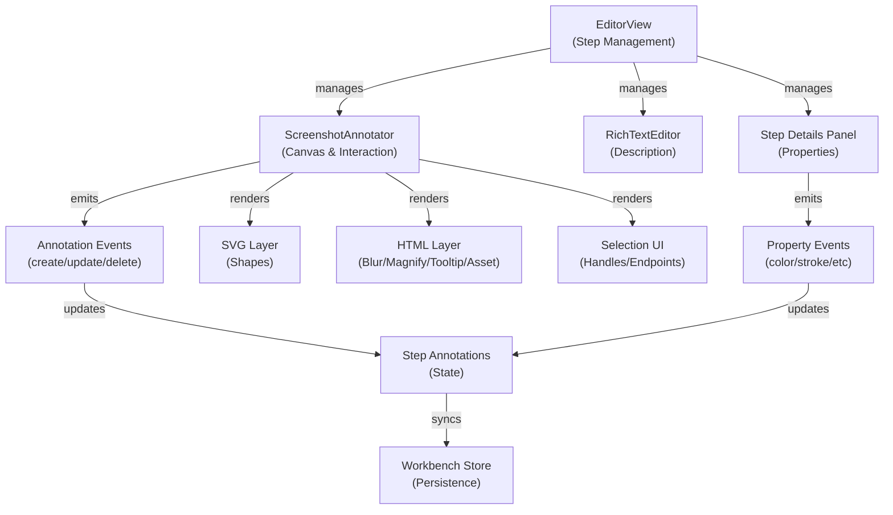

# Design Document: Editor Annotation Stabilization (P1)

## Overview

P1 focuses on stabilizing the editor's annotation interaction system. The ScreenshotAnnotator component has complete drawing, selection, and manipulation capabilities, but needs systematic validation and refinement across all 13 annotation types. This phase ensures reliable interaction patterns, proper focus management between the annotation canvas and rich text editor, and optimized rendering performance for complex annotation scenarios.

The goal is to achieve production-ready stability for the core annotation workflow: draw → select → edit → delete → layer manage, with seamless integration between the visual annotation editor and the step details panel.

## Architecture



## Annotation Types & Interaction Patterns

### Area Annotations (Rectangular Bounds)

**Types**: rect, ellipse, text, blur, highlight, magnify, cursor, asset, tooltip

**Draw Interaction**:
- Click-drag from start point to end point
- Minimum size: 0.012 (1.2% of canvas)
- Aspect ratio preservation for: asset, magnify
- Compact creation for: text, tooltip, cursor (predefined sizes on single click)

**Edit Interaction**:
- Move: Click-drag anywhere on shape
- Resize: Drag corner handles (nw, ne, se, sw)
- Delete: Press Delete/Backspace when selected
- Text edit: Double-click or press Enter for text/tooltip types

**Rendering**:
- SVG for: rect, ellipse, highlight, text
- HTML div for: blur, magnify, tooltip, asset
- Selection border: 2px dashed blue (#356dff)

### Linear Annotations (Start-End Points)

**Types**: line, arrow, brush

**Draw Interaction**:
- Line/Arrow: Click-drag from start to end
- Brush: Click-drag to draw freehand path, points sampled at 0.0025 delta threshold
- Arrow: Automatic arrowhead on end point

**Edit Interaction**:
- Move: Click-drag anywhere on line
- Resize: Drag endpoint handles (start, end)
- Delete: Press Delete/Backspace when selected

**Rendering**:
- SVG polyline for brush with stroke-linecap="round"
- SVG line with optional polygon arrowheads
- Transparent hit area (18px stroke) for easier selection

### Point Annotations

**Types**: click

**Draw Interaction**:
- Single click creates numbered marker
- Auto-increment number based on existing click annotations
- Cursor glyph rendered at click location

**Edit Interaction**:
- Move: Click-drag to reposition
- Delete: Press Delete/Backspace when selected
- Cannot resize (fixed size based on zoom)

**Rendering**:
- SVG circle (outer glow) + ring + badge with number
- Cursor glyph overlay with drop shadow
- Selection: circular border

## Components & Interfaces

### ScreenshotAnnotator Component

**Props**:
```typescript
interface ScreenshotAnnotatorProps {
  imageSrc: string                          // Image URL
  imageAlt?: string                         // Alt text
  imageWidth?: number | null                // Natural width
  imageHeight?: number | null               // Natural height
  zoom?: number                             // Zoom percentage (10-100)
  annotations?: StepAnnotation[] | null     // Current annotations
  activeTool?: AnnotationTool               // Current tool: select|crop|[type]
}
```

**Emits**:
```typescript
interface ScreenshotAnnotatorEmits {
  'update:annotations': (value: StepAnnotation[]) => void
  'update:selectedId': (value: string | null) => void
  'request:crop': (value: { x, y, width, height }) => void
}
```

**Key Methods**:
- `handleCanvasMouseDown()`: Route to draw/select/click based on activeTool
- `handleWindowMouseMove()`: Update draft or move/resize selected annotation
- `handleWindowMouseUp()`: Finalize draw or commit move/resize
- `deleteSelectedAnnotation()`: Remove selected annotation
- `editTextAnnotation()`: Prompt for text content
- `startMovingAnnotation()`: Begin move interaction
- `startResizingAnnotation()`: Begin resize interaction

### Step Details Panel

**Responsibilities**:
- Display selected annotation properties
- Provide color/stroke/opacity controls
- Show type-specific controls (text content, tooltip placement, cursor variant, etc.)
- Layer ordering controls (forward/backward/front/back)
- Delete button

**Property Controls by Type**:
- **All**: color, strokeWidth, opacity
- **Fill types** (rect, ellipse, highlight, text, tooltip): fillColor, backgroundColor
- **Text types** (text, tooltip): text content, fontSize, fontWeight, textAlign, textColor
- **Tooltip**: tooltipPlacement (top/bottom/left/right), shadow
- **Magnify**: magnifyZoom (1.2-4x), shadow
- **Cursor**: cursorVariant (pointer/text/hand)
- **Line/Arrow**: lineStyle (solid/dashed), showArrowHeadStart, showArrowHeadEnd
- **Blur**: blurAmount (0-20px)

## Data Models

### StepAnnotation

```typescript
interface StepAnnotation {
  id: string                                // Unique identifier
  type: StepAnnotationType                  // Annotation type
  order: number                             // Z-order (0 = back)
  
  // Position & Size (normalized 0-1)
  x: number                                 // Left position
  y: number                                 // Top position
  width?: number                            // Width (area types)
  height?: number                           // Height (area types)
  x2?: number                               // End X (line types)
  y2?: number                               // End Y (line types)
  points?: Array<{x, y}>                    // Path points (brush)
  
  // Styling
  color?: string                            // Stroke color
  strokeWidth?: number                      // Stroke width (px)
  fillColor?: string                        // Fill color
  backgroundColor?: string                  // Background (text/tooltip)
  textColor?: string                        // Text color
  opacity?: number                          // Opacity (0-1)
  radius?: number                           // Border radius
  
  // Type-specific
  text?: string                             // Text content
  fontSize?: number                         // Font size (px)
  fontWeight?: number                       // Font weight (400-700)
  textAlign?: 'left'|'center'|'right'       // Text alignment
  lineStyle?: 'solid'|'dashed'              // Line style
  showArrowHeadStart?: boolean               // Arrow start
  showArrowHeadEnd?: boolean                // Arrow end
  blurAmount?: number                       // Blur radius (px)
  magnifyZoom?: number                      // Magnify zoom (1.2-4)
  cursorVariant?: 'pointer'|'text'|'hand'   // Cursor type
  tooltipPlacement?: 'top'|'bottom'|'left'|'right'  // Tooltip arrow
  shadow?: boolean                          // Drop shadow
  number?: number                           // Click marker number
  asset?: StepAssetRef                      // Asset reference
}
```

### Interaction State

```typescript
type InteractionState =
  | {
      mode: 'draw'
      tool: AnnotationTool
      start: { x, y }
    }
  | {
      mode: 'move'
      id: string
      start: { x, y }
      original: StepAnnotation
    }
  | {
      mode: 'resize'
      id: string
      handle: 'nw'|'ne'|'se'|'sw'|'start'|'end'
      start: { x, y }
      original: StepAnnotation
    }
```

## Correctness Properties

### Property 1: Annotation Bounds Consistency
**Precondition**: Annotation exists with valid x, y, width, height
**Postcondition**: All bounds values are normalized to [0, 1] range
**Invariant**: `0 ≤ x ≤ 1 AND 0 ≤ y ≤ 1 AND 0 < width ≤ 1-x AND 0 < height ≤ 1-y`

### Property 2: Move Operation Preserves Size
**Precondition**: Annotation selected, move interaction initiated
**Postcondition**: After move, width and height unchanged
**Invariant**: `width_before === width_after AND height_before === height_after`

### Property 3: Resize Respects Aspect Ratio
**Precondition**: Asset or magnify annotation, resize interaction
**Postcondition**: Aspect ratio maintained within bounds
**Invariant**: `abs(width_after/height_after - original_ratio) < 0.01`

### Property 4: Minimum Size Enforcement
**Precondition**: Any annotation created or resized
**Postcondition**: Size never below minimum threshold
**Invariant**: `width ≥ 0.012 AND height ≥ 0.012`

### Property 5: Z-Order Consistency
**Precondition**: Multiple annotations exist
**Postcondition**: Order values are unique and sequential
**Invariant**: `all(order[i] < order[i+1]) AND max(order) === length-1`

### Property 6: Selection Uniqueness
**Precondition**: Annotation interaction occurs
**Postcondition**: At most one annotation selected
**Invariant**: `count(selected) ≤ 1`

### Property 7: Focus Management
**Precondition**: User interacts with annotation canvas or text editor
**Postcondition**: Only one component has focus, no event conflicts
**Invariant**: `(canvas_focused XOR editor_focused) AND no_duplicate_events`

### Property 8: Undo/Redo Consistency
**Precondition**: Annotation modified, undo triggered
**Postcondition**: Annotation reverts to previous state
**Invariant**: `undo(modify(A)) === A`

## Error Handling

### Scenario 1: Invalid Annotation Bounds
**Condition**: Annotation with x > 1 or y > 1 or width ≤ 0
**Response**: Clamp to valid range during normalization
**Recovery**: Auto-correct on load, log warning

### Scenario 2: Missing Annotation Reference
**Condition**: Selected annotation ID not found in list
**Response**: Clear selection, emit update:selectedId(null)
**Recovery**: Sync state with parent component

### Scenario 3: Concurrent Modifications
**Condition**: Annotation modified while interaction in progress
**Response**: Use original snapshot for resize/move calculations
**Recovery**: Commit changes to latest state after interaction ends

### Scenario 4: Focus Conflict
**Condition**: Both canvas and text editor receive input simultaneously
**Response**: Canvas takes priority during annotation interaction
**Recovery**: Release focus after interaction completes

### Scenario 5: Zoom Out of Bounds
**Condition**: Zoom < 10% or > 100%
**Response**: Clamp to valid range
**Recovery**: Recalculate stage dimensions

## Testing Strategy

### Unit Testing Approach

**Test Categories**:
1. **Bounds Calculation**: Verify normalization, clamping, aspect ratio preservation
2. **Interaction State**: Test draw/move/resize state transitions
3. **Annotation Creation**: Verify all 13 types create with correct defaults
4. **Selection Management**: Test select/deselect, uniqueness
5. **Event Emission**: Verify correct events emitted with correct payloads
6. **Keyboard Shortcuts**: Delete, Escape, Enter for text edit
7. **Zoom Handling**: Stage dimension recalculation at various zoom levels

**Coverage Goals**: >85% line coverage, 100% for critical paths (bounds, interaction)

### Property-Based Testing Approach

**Property Test Library**: fast-check (JavaScript/TypeScript)

**Key Properties to Test**:
1. **Bounds Normalization**: For any annotation, bounds always in [0,1]
2. **Move Idempotence**: Moving by (0,0) doesn't change annotation
3. **Resize Commutativity**: Resize order doesn't affect final bounds (for non-aspect-ratio types)
4. **Zoom Scaling**: Pixel coordinates scale linearly with zoom
5. **Point Sampling**: Brush points maintain minimum delta distance
6. **Z-Order Stability**: Layer operations maintain order consistency

### Integration Testing Approach

**Test Scenarios**:
1. **Full Annotation Lifecycle**: Create → Select → Edit → Delete
2. **Multi-Annotation Workflow**: Create multiple, select different, layer reorder
3. **Focus Transitions**: Canvas → Text editor → Canvas without conflicts
4. **Undo/Redo**: Verify annotation state reverts correctly
5. **Zoom Transitions**: Change zoom, verify interaction still works
6. **Asset Integration**: Import asset, resize with aspect ratio, verify bounds

## Performance Considerations

### Rendering Optimization

**Current Approach**:
- SVG for vector shapes (rect, ellipse, line, arrow, brush, text, highlight)
- HTML div for raster effects (blur, magnify, tooltip, asset)
- Selection UI as separate overlay

**Optimization Strategies**:
1. **Memoization**: Cache computed bounds, display annotations
2. **Lazy Rendering**: Only render visible annotations (viewport culling)
3. **Batch Updates**: Collect multiple changes, single re-render
4. **Virtual Scrolling**: For annotation list in details panel (if >50 annotations)

**Performance Targets**:
- 60 FPS during drag operations
- <100ms for annotation creation
- <50ms for selection change
- Smooth zoom transitions (no jank)

### Memory Optimization

**Strategies**:
1. **Annotation Pooling**: Reuse annotation objects during interaction
2. **Event Delegation**: Single listener for all shapes vs. per-shape listeners
3. **Cleanup**: Remove event listeners on unmount
4. **Debouncing**: Throttle move/resize events during drag

## Security Considerations

### Input Validation

1. **Bounds Validation**: All x, y, width, height clamped to [0, 1]
2. **Text Sanitization**: HTML escape text content to prevent XSS
3. **Color Validation**: Validate hex/rgba format before applying
4. **Number Validation**: Ensure numeric fields are finite and in valid ranges

### Asset Security

1. **URL Validation**: Verify asset URLs are from trusted sources
2. **File Type Validation**: Only allow image types (png, jpg, gif, webp)
3. **Size Limits**: Enforce maximum asset dimensions (4096x4096)

## Dependencies

**Internal**:
- `@shared/step-annotations.ts`: Annotation utilities, bounds calculation
- `@shared/contracts.ts`: Type definitions
- `@renderer/stores/workbench.ts`: State management

**External**:
- Vue 3 (composition API)
- TypeScript

**Browser APIs**:
- Canvas/SVG rendering
- Mouse events (mousedown, mousemove, mouseup)
- Keyboard events (keydown)
- ResizeObserver (for zoom recalculation)

## Implementation Phases

### Phase 1: Validation & Stabilization (Week 1-2)
- Systematic testing of all 13 annotation types
- Fix interaction bugs (move, resize, delete)
- Validate bounds clamping and normalization
- Test focus management between canvas and editor

### Phase 2: UI Polish (Week 2-3)
- Refine selection handles and endpoints
- Improve visual feedback during interactions
- Optimize performance for large annotation counts
- Add keyboard shortcuts documentation

### Phase 3: Integration & Regression (Week 3-4)
- Test with real screenshots
- Verify undo/redo consistency
- Test zoom transitions
- Validate Step Details panel property controls
- End-to-end workflow testing

### Phase 4: Documentation & Handoff (Week 4)
- Document interaction patterns
- Create troubleshooting guide
- Prepare for P2 (advanced features)
